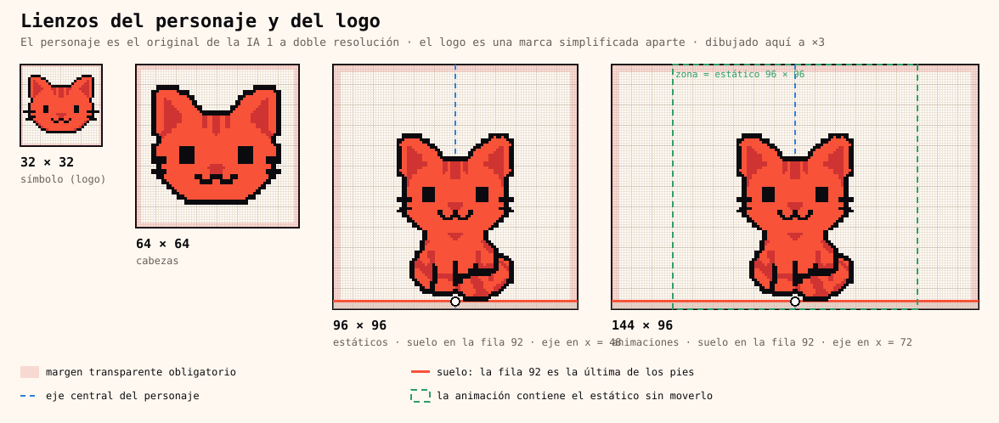

# Especificación del personaje

Versión 2.0 · 2026-09-26 · **Rige todo el arte del personaje.** Quien dibuje, anime o genere arte, sea persona o IA, parte de este documento.

> **Estado.** Los 14 estáticos siguen esta versión. Las 20 animaciones siguen siendo las de la edición 2026-09-25: están en otro lienzo y a la mitad de densidad, y se rehacen después (ver [Estado y migración](#16-estado-y-migración)).

El personaje es el gato atigrado naranja **diseñado por la IA 1** en las hojas de [06-originales](../06-originales/README.md). Nombre interno: Meli; nombre público: GatoPago. **Ese diseño es el modelo.** Esta especificación no lo cambia: fija cómo reproducirlo como pixel art limpio y coherente.

## 1. Principios

1. **El original manda.** Cada pieza se construye sobre su original de la IA 1 y se compara con él lado a lado antes de aprobarse. No se inventan proporciones, cabezas ni rasgos.
2. **Una sola densidad para el personaje.** Se dibuja a doble resolución de las hojas originales: 1 celda es medio bloque del original. Todas sus piezas comparten esa densidad y se muestran al mismo múltiplo en una misma vista.
   - Una cabeza suelta puede ser más grande que la cabeza de un cuerpo entero, como un retrato frente a un plano general. Lo que no cambia es el tamaño de la celda.
3. **El logo es otra pieza.** El símbolo de 30 × 23 es una marca simplificada para tamaños pequeños. No se usa como cabeza del personaje ni se pone junto a él a otra escala de píxel.
4. **El arte se escribe, no se retoca.** Cada pieza es un mapa de texto (`.txt`) y todo lo demás se genera. Ningún PNG se edita a mano.
5. **Nada entra al kit sin QA automático y aprobación humana.**

## 2. Rejilla y escala

- 1 celda = 1 píxel del mapa = medio bloque de las hojas originales.
- **Solo escalas enteras**, con vecino más cercano.
- **Solo giros de 90°.** Una cabeza inclinada se dibuja: su silueta sale del original y sus rasgos se colocan a mano.

## 3. Lienzos

| Lienzo | Tamaño | Uso | Colocación | Margen vacío |
|---|---|---|---|---|
| Símbolo mini | 16 × 16 | Favicon 16 | El mapa [simbolo-16.txt](../02-logos/modelo/simbolo-16.txt) | 0 |
| Símbolo | 32 × 32 | Logo, favicon 32, iconos | Cabeza del logo en (1, 4) | 1 |
| Cabeza | 64 × 64 | Cabezas con expresión y avatares | Centrada | 2 |
| Estático | 96 × 96 | Poses completas | Eje en x = 48, suelo en la fila 92 | 3 |
| Animación | 144 × 96 | Todas las secuencias | Eje en x = 72, suelo en la fila 92 | 3 |

- **Eje.** La línea vertical entre las columnas 47 y 48 del estático, y entre la 71 y la 72 de la animación.
- **Suelo.** En toda pose apoyada, la fila 92 es la última fila opaca. Por debajo no hay nada.
- **La animación contiene al estático sin moverlo.** El frame de reposo es el estático desplazado 24 columnas. Toda secuencia en el sitio puede recortarse a 96 × 96 por las columnas 24–119.
- Las medidas están también en `scripts/mascota/lib/especificacion.mjs`, y la guía se dibuja desde ahí.

Tamaños de exportación, siempre con vecino más cercano:

| Lienzo | ×1 | ×4 | ×8 |
|---|---|---|---|
| 64 × 64 | 64 × 64 | 256 × 256 | 512 × 512 |
| 96 × 96 | 96 × 96 | 384 × 384 | 768 × 768 |
| 144 × 96 | 144 × 96 | 576 × 384 | 1152 × 768 |

## 4. Construcción

### 4.1 Cabeza

La referencia es `head-neutral`: la cabeza de la IA 1.

- **Orejas** altas, con el borde exterior casi vertical y un triángulo de Cat Shadow en el interior.
- **Tres rayas** en la frente.
- **Ojos** de tinta de 6 × 7, bien separados y a media altura.
- **Nariz** en cuña de Cat Shadow.
- **Boca «ω»** de trazos de 2 celdas.
- **Dos bigotes por lado.** El primero nace dentro del abultamiento de la mejilla y el segundo sobresale por debajo.
- **Sin línea en la barbilla.** El pecho continúa desde la cara, con una sombra en forma de babero bajo la boca.

Hay tres vistas, todas del original:

| Vista | Piezas | Rasgos |
|---|---|---|
| Frente | cabezas, sentado, QR | Simétrica |
| 3/4 | mensajero | Oreja lejana más pequeña; ojo lejano más estrecho junto al contorno; bigotes lejanos asomando |
| Perfil | carrito | Un solo ojo con brillo; boca pequeña en el hocico |

**Inclinadas** (curiosa, tarjeta, durmiendo):
- La silueta sale del original.
- Los ojos se dibujan rectos, sin girar.
- La boca se inclina en dos mitades rígidas, y los bigotes siguen la mejilla.

### 4.2 Cuerpo

- **Proporción chibi**: en las poses sentadas, la cabeza ocupa alrededor del 60 % de la altura.
- **Cuerpo compacto en forma de pera** con ancas redondas que sobresalen a los lados.
- **Patas delanteras cortas**, separadas por líneas de tinta, con zarpas redondeadas.
- **Cola gruesa, enroscada y con anillos**. En el sentado pasa por delante del anca y termina con la punta hacia arriba.
- **Rayas atigradas** en ancas, patas y cola: bandas de Cat Shadow de al menos 2 celdas, sin manchas sueltas.

### 4.3 Expresiones

| Pieza | Ojos | Boca | Orejas |
|---|---|---|---|
| neutral | 6 × 7 de tinta | ω | normales |
| feliz | arcos | ω | normales |
| concentrada | con brillo Milk hacia fuera | ω | normales |
| cautelosa | 6 × 7 | ondulada | bajas, hacia los lados |
| curiosa | con brillo arriba a la derecha | ω inclinada | normales (cabeza inclinada) |
| emocionada | octógonos con una cruz Milk | abierta con lengua | normales |
| dormida | cerradas | ω | una doblada |
| asomada | ojo con brillo | media ω | tapada por un borde |

## 5. Color

La paleta es cerrada: [modelo/paleta.json](./modelo/paleta.json).

| Carácter | Color | Uso en el gato |
|---|---|---|
| `#` | Ink | Contorno, ojos, boca, bigotes y líneas de separación |
| `o` | Cat Fire | Pelaje |
| `s` | Cat Shadow | Rayas, interior de las orejas, nariz, babero y sombras de la mejilla |
| `w` | Milk | Brillo de los ojos, papel, QR y borde de la versión oscura |
| `p` | Lengua | Lengua |

Cat Deep (`d`) está en la paleta, pero el modelo de la IA 1 no lo usa: las extremidades se separan con línea de tinta. Los accesorios tienen sus propios colores (caja, tarjeta, rail, estados) y nunca se usan en el pelaje. Prohibido:
- usar degradados;
- usar semitransparencias: el alfa solo vale 0 o 255;
- tramar.

## 6. Línea

- **Contorno exterior de Ink de 2 celdas**, continuo y cerrado: ningún relleno toca lo transparente. Es el grosor del original.
- **Líneas interiores, rasgos y bigotes también de 2 celdas.**
- **Curvas escalonadas regulares**, sin bultos ni muescas de una celda.
- **Sin línea en la barbilla**: la cara continúa en el pecho.

## 7. Luz y sombra

Como el original: color plano de Cat Fire. Cat Shadow se reserva para las marcas y para las sombras suaves del original: babero, mejillas e interior de las orejas. Sin brillos en el pelaje, sin tramas y sin sombra proyectada.

## 8. Fondos oscuros

Sobre Ink, Ink Soft (#15151B), Ink Raised (#1D1D24) y otros fondos oscuros, el contorno Ink desaparece. Sobre Cat Fire o Cat Shadow, el relleno se funde con el fondo. En ambos casos se usa la **versión con borde Milk**:

- Un borde Milk de 1 celda alrededor de la silueta, en conectividad 8.
- Lleva el sufijo `-oscuro`, el mismo lienzo y el mismo apoyo.
- **Se genera en el build; nunca se dibuja a mano.**
- El logo mantiene su propia regla: en fondo oscuro va sobre un contenedor Milk.

## 9. Animación

### 9.1 Método

1. **La acción en una frase.**
2. **Poses clave a partir de los estáticos y de las hojas de animación de la IA 1**, aprobadas en silueta. Después los intermedios y, al final, la acción secundaria.
3. **El frame 1 es la pose de reposo**: el estático correspondiente.

Reglas de movimiento:

- **Movimiento en celdas enteras.** No se rotan partes.
- **Compresión y estiramiento**:
  - como máximo 4 filas, con el apoyo fijo;
  - solo en la anticipación, el impulso y el contacto.
- **Acción secundaria**:
  - la cola y las orejas siguen al cuerpo un frame después;
  - nunca se adelantan a la acción principal.
- **Cabeza y rasgos iguales en todos los frames**, salvo el cambio de expresión o de giro que la acción pida.
- **Sin frames consecutivos idénticos.**

### 9.2 Frames y tiempos

| Acción | Frames | Duración por frame |
|---|---|---|
| Parpadeo | 3 | 50–70 ms, dentro de un reposo de 2 a 4 s |
| Reposo o respiración | 2–4 | 250–400 ms |
| Caminar | 6: contacto, bajada, paso ×2 | 110–130 ms, en el sitio, con `zancada` en el manifiesto |
| Correr | 6 | 70–90 ms |
| Saltar | 6–7 | 60–160 ms según la fase |
| Saludar | 4–6 | 120–160 ms |
| Reacción (una vez) | 4–8 | 80–200 ms; termina en reposo |

- **Mínimo de 50 ms** y máximo de 12 frames por secuencia.
- Los tiempos van frame a frame en el manifiesto.
- **Reproducción:** `loop` (en bucle) u `once` (una vez). Las `once` terminan en una pose estable.

## 10. Exportación y archivos

- **Fuente**: los mapas `.txt` de `modelo/estaticos/`. Todo lo demás se genera con `npm run brandkit:mascota`.
- **Estáticos y cabezas**: PNG ×1, ×4 y ×8, y SVG, cada uno también en versión `-oscuro`.
- **Animaciones**:
  - frames ×1 y ×4;
  - tira y cuadrícula;
  - previews WebP sin pérdida y GIF;
  - manifiesto JSON.
- **Formato**: PNG RGBA con alfa 0 o 255. Nunca JPEG ni WebP con pérdida.

## 11. Uso en producto

- **Tamaño en CSS**: `image-rendering: pixelated`, con ancho y alto iguales al lienzo multiplicado por un entero.
- **Escala CSS siempre entera.** El ×1,5 queda descartado.
- **Un solo múltiplo por vista** para todo el personaje.
- **Fondos oscuros o del color del pelaje**: versión `-oscuro`.

## 12. Control de calidad

`npm run brandkit:mascota` bloquea la entrega si falla una regla automática.

| Regla | Estado |
|---|---|
| Solo colores de la paleta; alfa 0 o 255 | Automática |
| Contorno cerrado; una sola figura por mapa | Automática |
| Lienzo según el tipo (`; lienzo: cabeza` o `estatico`); márgenes; suelo en la fila 92 | Automática en estáticos |
| Pelaje de 1 celda de ancho | Aviso con coordenadas en `qa/informe.json`, para revisión humana |
| Duración mínima de 50 ms; tiempos del manifiesto iguales a los de la preview | Automática |
| Cada PNG ×1 igual a su mapa; ×4 y ×8, escalados exactos; versión oscura igual al borde Milk | Automática (verify) |
| **Fidelidad al original** | Revisión humana, lado a lado con la hoja de la IA 1 |

## 13. Prohibido

1. Sustituir el diseño de la IA 1 por otro: otra cabeza (incluida la del logo), otras proporciones u otros rasgos.
2. Generar o retocar arte final con IA de imagen, filtros o ampliadores sin redibujar.
3. Mezclar densidades en el personaje o mostrar sus piezas a distintos múltiplos en una vista.
4. Escalar por un factor no entero o rotar píxeles en ángulos que no sean de 90°.
5. Usar antialias, semitransparencias, degradados o tramas.
6. Dejar contornos de 1 o de 3 celdas, contornos abiertos o una línea en la barbilla.
7. Dejar manchas de color sueltas: las rayas son bandas.
8. Editar un PNG a mano, dejar pruebas sueltas dentro del kit o escribir enlaces absolutos (`file://`).

## 14. Proceso y aprobación

1. **Brief**: la pose o acción en una frase, con su original de referencia.
2. **Construcción sobre el original** a doble resolución, con limpieza de contorno, color y rasgos.
3. **Comparación lado a lado** con el original a tamaño de uso.
4. **QA automático**, y revisión a ×2 y ×4 sobre fondo claro y oscuro.
5. **Aprobación**; después, `brandkit:mascota`, `brandkit:build`, `brandkit:verify` y `brandkit:test`.

Reglas del proceso:

- Las propuestas no se guardan en `brandkit/`. Solo entra lo aprobado.
- Cualquier cambio en este documento sube la versión y se anota en el historial.

## 15. Decisiones vigentes

- **Modelo:** el de la IA 1, reproducido a doble resolución (2026-09-26).
- **Cabeza hacia la acción:** en 3/4 o de perfil cuando el gato se desplaza, como en el original (2026-09-26).
- **Fondos oscuros:** borde Milk generado (2026-09-26).
- **Logo:** marca simplificada aparte, solo a escalas enteras; en la navegación, ×1 o ×2.

## 16. Estado y migración

- **Hecho:** los 14 estáticos (8 cabezas de 64 × 64 y 6 poses de 96 × 96), con versiones ×1, ×4, ×8, SVG y oscura.
- **Pendiente:** rehacer las 20 animaciones en 144 × 96, a esta densidad y con estas piezas, y retirar `animaciones/piezas-v1`.

Las animaciones actuales (2026-09-25) usan el lienzo de 48 × 44, a la mitad de densidad. No deben mostrarse en la misma vista que los estáticos al mismo múltiplo, porque sus píxeles serían el doble de grandes.

## Historial

| Versión | Fecha | Cambio |
|---|---|---|
| 1.0 | 2026-09-26 | Primera versión: lienzos, construcción, color, línea, luz, expresiones, animación, exportación, QA y proceso |
| 1.1 | 2026-09-26 | Estáticos redibujados con la cabeza del logo como molde. Rechazados: se alejaban del diseño original |
| 2.0 | 2026-09-26 | El modelo vuelve a ser el de la IA 1, reproducido a doble resolución: contorno de 2 celdas, cabezas en 64 × 64, estáticos en 96 × 96, animaciones en 144 × 96. El logo queda como marca aparte |
